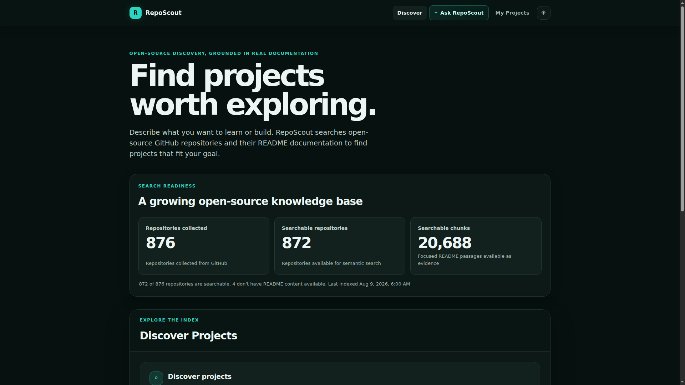
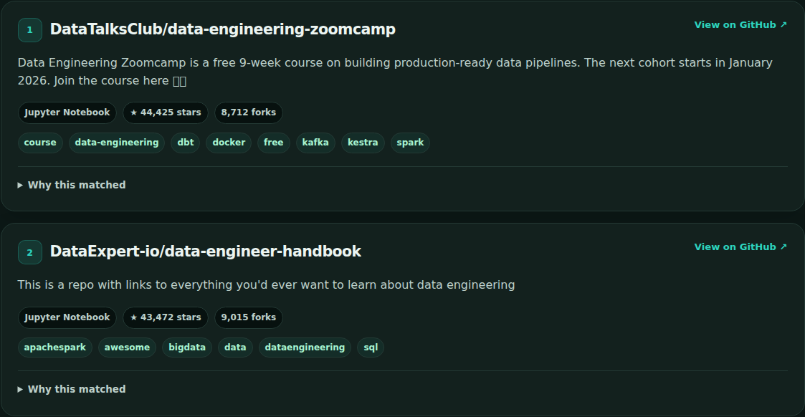
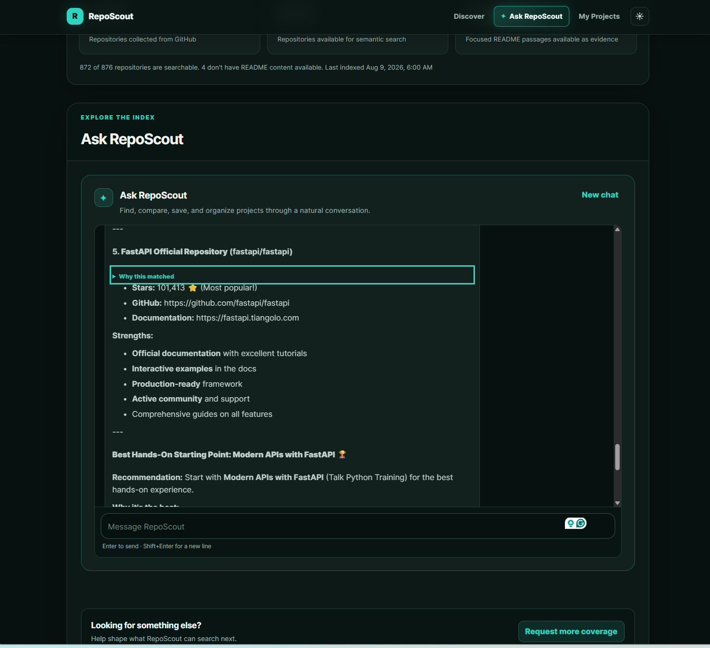
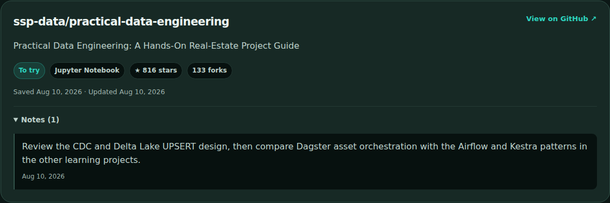
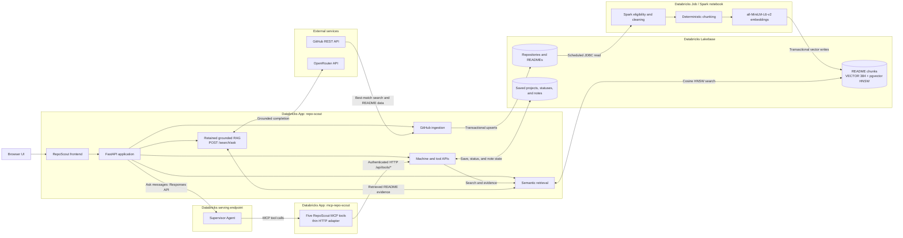
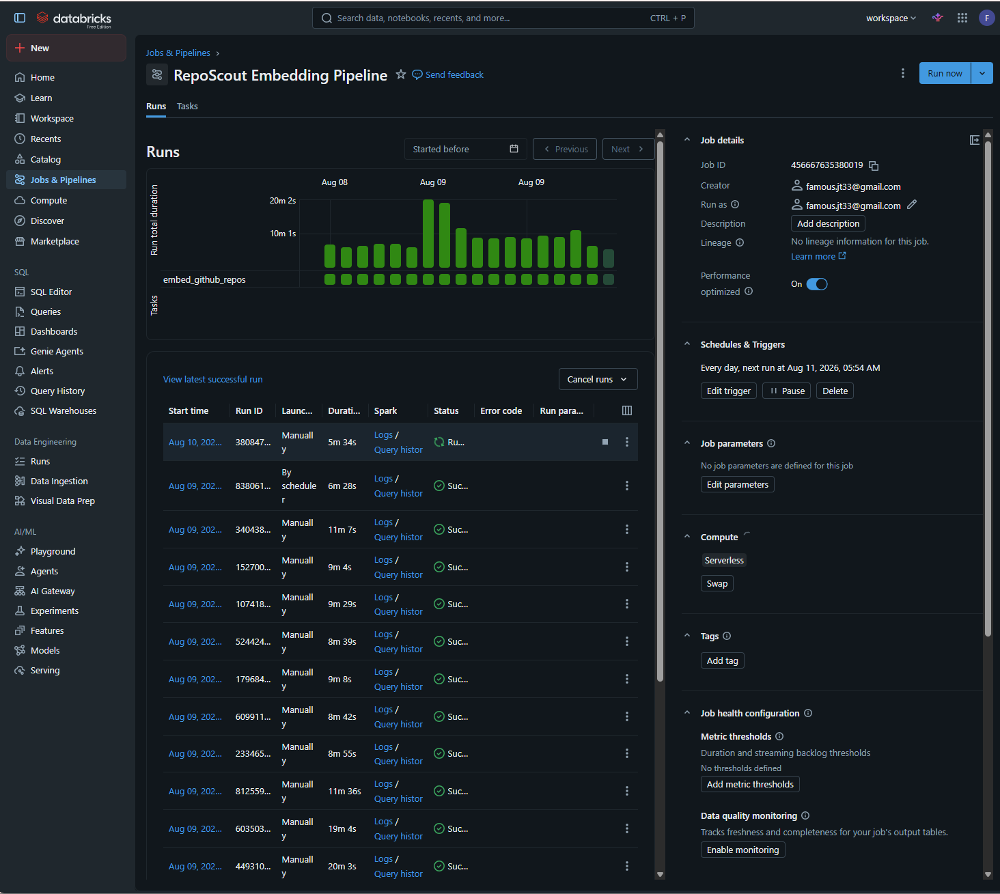

# RepoScout

RepoScout is an AI-powered assistant for discovering, evaluating, and organizing open-source
GitHub projects. It searches indexed README evidence rather than relying on repository names or
popularity alone, then lets users refine recommendations conversationally and retain useful
projects with statuses and notes.



## Table of Contents

1. [Overview](#overview)
2. [Product Experience](#product-experience)
3. [Architecture](#architecture)
4. [Repository Structure](#repository-structure)
5. [Setup and Configuration](#setup-and-configuration)
6. [Data Pipeline and Operations](#data-pipeline-and-operations)
7. [Databricks Deployment](#databricks-deployment)
8. [APIs, MCP, and Supervisor Integration](#apis-mcp-and-supervisor-integration)
9. [Security and Identity Model](#security-and-identity-model)
10. [Testing and Quality Checks](#testing-and-quality-checks)
11. [Known Limitations and Future Evolution](#known-limitations-and-future-evolution)
12. [Example User Journey](#example-user-journey)
13. [License](#license)

## Overview

RepoScout turns a growing GitHub repository collection into an evidence-backed knowledge base:

```text
GitHub repository search
        ↓
FastAPI ingestion
        ↓
Lakebase repositories + READMEs
        ↓
Databricks Spark cleaning and chunking
        ↓
Sentence Transformer embeddings
        ↓
Lakebase pgvector/HNSW index
        ↓
Discover, Ask RepoScout, and MCP tools
```

The implementation deliberately separates deterministic retrieval from agent orchestration:

- **Discover** embeds the user query, performs pgvector cosine search, applies an internal
  relevance threshold, and ranks distinct repositories deterministically.
- **Ask RepoScout** sends natural-language requests to a Databricks Supervisor Agent. The
  Supervisor uses RepoScout's MCP tools to search, inspect, save, update, and annotate projects.
- **My Projects** displays the saved-project state written through those tools.
- **Coverage feedback** records what a user hoped to find for later review. It never triggers
  ingestion automatically.
- **`POST /search/ask`** remains available as a separate grounded OpenRouter RAG API, but it is not
  the normal browser Ask experience.

## Product Experience

### Demo video

[Watch the RepoScout end-to-end demo on Loom](https://www.loom.com/share/e239a2b9cba546d58a11cd245d8cd7de).

Please excuse the narration quality; I was recovering from a nasty cold when I recorded the demo.

The walkthrough demonstrates repository discovery, evidence-backed recommendations, conversational
follow-ups, saved-project actions, and project organization in My Projects.

### Discover

Users describe what they want to learn or build, optionally filter by primary language and stars,
and request between one and ten results. Each repository result includes useful GitHub metadata and
expandable indexed README evidence. The expanded evidence may show a qualitative `Strong`,
`Moderate`, or `Limited` README match derived from the existing cosine similarity. Numeric scores,
percentages, and vector-search internals remain hidden from the normal interface.



### Ask RepoScout

Ask RepoScout supports natural follow-ups such as comparing returned projects, requesting more
detail, saving a repository, changing its progress status, or adding a note. Only visible user and
assistant messages and their validated project-card data reach browser session storage; MCP calls,
tool arguments, raw tool outputs, approvals, and reasoning stay on the backend.

Ask recommendations are still evidence-backed: the Supervisor searches through RepoScout's MCP
tools and receives bounded, indexed README excerpts for the repositories it inspects. A typed
presentation mode keeps search/list/recommendation results as deterministic project cards with
expandable **Why this matched** evidence, while comparison and project-detail turns emphasize
conversational reasoning followed by compact validated repository links. Explicit evidence requests
restore full cards. Write confirmations and ordinary conversation remain text-only. Raw MCP
payloads, tool arguments, approvals, and reasoning remain private. Numeric similarity is used only
to derive the qualitative README-match label on evidence cards.



### My Projects

Saved repositories can be classified as `Interested`, `To Try`, `In Progress`, or `Completed`.
My Projects is read-only in the browser; state-changing actions are requested conversationally and
performed through the MCP tools. Each card shows at most the ten most recent notes.



### Coverage feedback and readiness

The application reports repositories collected, repositories currently searchable, searchable
README chunks, last indexing time, and user-friendly reasons for any coverage gap. Users can submit
a natural-language indexing request with optional context when the current knowledge base does not
cover their need. Repeated requests are retained as useful demand signals.

**Repository collection is deliberately curated.** Coverage requests capture unmet demand; they do
not discover or ingest repositories automatically. A human/platform operator manually reviews each
request at an approval gate, selects appropriate GitHub repositories, and invokes the controlled
ingestion API. After approved content reaches Lakebase, the scheduled Spark pipeline incrementally
prepares it for semantic search.

The frontend is framework-free HTML, CSS, and vanilla JavaScript. It provides dark and light
themes, system-theme detection, keyboard and reduced-motion support, responsive layouts, safe DOM
rendering, and relative URLs that work behind the Databricks Apps proxy.

## Architecture

### Final deployed architecture



The upper data path builds the searchable README index; the lower runtime path handles browser
discovery, Supervisor-orchestrated MCP actions, saved-project state, and the retained direct
OpenRouter RAG API. The MCP App remains a thin adapter and has no direct Lakebase access.

### Runtime boundaries

| Component | Responsibility | Direct external access |
| --- | --- | --- |
| `repo-scout` App | Frontend, ingestion, retrieval, RAG, tool API, conversations, saved state | GitHub, Lakebase, OpenRouter, Supervisor |
| Spark notebook/Job | Incremental README processing and embedding persistence | Lakebase, Hugging Face model download |
| `mcp-repo-scout` App | Thin MCP-to-HTTP adapter exposing five tools | RepoScout App only |
| Supervisor endpoint | Natural-language orchestration over the MCP tools | MCP App |
| Lakebase | Application tables and pgvector index | OAuth-authenticated clients |

The MCP application contains no Lakebase, psycopg, Sentence Transformer, pgvector, retrieval, or
saved-project persistence implementation.

## Repository Structure

```text
reposcout/
├── app/
│   ├── database/        # Lakebase OAuth credentials and async pool
│   ├── repositories/    # Explicit parameterized psycopg SQL
│   ├── routers/         # FastAPI HTTP concerns and safe error mapping
│   ├── schemas/         # Pydantic request and response contracts
│   ├── services/        # Ingestion, retrieval, RAG, Supervisor, and orchestration
│   ├── config.py
│   ├── dependencies.py
│   └── main.py
├── alembic/             # Handwritten schema migrations
├── databricks/
│   └── jobs/            # Portable Databricks Job settings
├── frontend/            # Committed HTML, CSS, SVG, and ES modules
├── notebook/
│   └── process_repository_embeddings.ipynb
├── mcp-server/          # Independently deployable MCP App
├── tests/               # Main application and contract tests
├── artifacts/
│   └── demo-walkthrough-screenshots/  # Complete product demo capture set
├── app.yaml             # Main Databricks App configuration
├── pyproject.toml
└── README.md
```

FastAPI lifespan explicitly opens and closes shared clients and the Lakebase pool. Routers handle
HTTP behavior, services own orchestration, repositories own SQL, and database modules own OAuth and
connection lifecycle concerns.

## Setup and Configuration

### Prerequisites

- Python 3.12 or newer and [`uv`](https://docs.astral.sh/uv/).
- Databricks CLI authentication.
- A Databricks workspace with Lakebase Autoscaling and pgvector support.
- A developer PostgreSQL OAuth role with the required migration and data privileges.
- A GitHub token for authenticated REST requests.
- Optional OpenRouter credentials for the retained `/search/ask` API.
- A configured Supervisor serving endpoint for the browser Ask experience.

Authenticate the local CLI profile using placeholders appropriate to the target workspace:

```bash
databricks auth login \
  --host https://<workspace-host> \
  --profile reposcout

databricks current-user me --profile reposcout
```

### Local development

Copy the template and populate only local values:

```bash
cp .env.example .env
uv sync --all-groups
export APP_ENV=local
uv run alembic upgrade head
uv run fastapi dev
```

`APP_ENV` must exist in the process environment before settings are built. The optional `.env`
file is loaded only after `APP_ENV=local` is established. Test and Databricks environments ignore
`.env`.

The first semantic search loads `sentence-transformers/all-MiniLM-L6-v2`; an initial local request
can therefore take longer while the model is downloaded and initialized.

### Main application configuration

| Variable | Required | Default/purpose |
| --- | --- | --- |
| `APP_ENV` | Yes | One of `local`, `test`, or `databricks` |
| `DATABRICKS_CONFIG_PROFILE` | Local when needed | Databricks CLI profile used by SDK clients |
| `GITHUB_TOKEN` | Outside tests | GitHub REST authentication |
| `GITHUB_API_URL` | No | `https://api.github.com` |
| `GITHUB_API_VERSION` | No | Versioned GitHub API header |
| `GITHUB_TIMEOUT_SECONDS` | No | GitHub request timeout |
| `GITHUB_README_CONCURRENCY` | No | Bounded concurrent README retrieval |
| `GITHUB_RETRY_ATTEMPTS` | No | Additional transient retries; default 2 |
| `PGHOST`, `PGDATABASE`, `PGUSER` | Outside tests | Lakebase PostgreSQL connection identity |
| `PGPORT` | No | `5432` |
| `PGSSLMODE` | No | `require` |
| `LAKEBASE_ENDPOINT` | Outside tests | Lakebase endpoint resource name used for OAuth credentials |
| `DB_POOL_MIN_SIZE`, `DB_POOL_MAX_SIZE` | No | Async physical connection bounds |
| `DB_POOL_MAX_LIFETIME_SECONDS` | No | Recycles connections before OAuth expiry; default 3300 |
| `DB_POOL_TIMEOUT_SECONDS` | No | Pool acquisition timeout |
| `SEARCH_MIN_SIMILARITY` | No | Internal retrieval threshold; default `0.25` |
| `LLM_API_BASE_URL` | No | OpenRouter-compatible base URL |
| `LLM_API_KEY` | For `/search/ask` generation | Optional `SecretStr`; semantic search works without it |
| `LLM_MODEL_NAME` | No | `openrouter/free` |
| `LLM_REQUEST_TIMEOUT` | No | OpenRouter timeout in seconds |
| `LLM_MAX_OUTPUT_TOKENS` | No | Completion headroom; default 2000 |
| `SUPERVISOR_ENDPOINT_NAME` | For browser Ask | Supervisor serving-endpoint name, not a secret |
| `SUPERVISOR_REQUEST_TIMEOUT_SECONDS` | No | Per-cycle Supervisor timeout; default 120 seconds |
| `SUPERVISOR_TASK_TIMEOUT_SECONDS` | No | Overall bounded turn deadline; default 300 seconds |

Generated Lakebase passwords are never settings. The pool's async connection-parameter provider
generates a fresh credential before every new physical PostgreSQL connection and recycles
connections before the one-hour credential lifetime.

### MCP application configuration

The committed MCP source lives in `mcp-server/`; the deployed application is named
`mcp-repo-scout`.

| Variable | Mode | Purpose |
| --- | --- | --- |
| `REPOSCOUT_API_APP_URL` | Local | Direct RepoScout URL; no Databricks authentication is added |
| `REPOSCOUT_APP_NAME` | Databricks | Target App name injected from resource key `reposcout` |
| `REPOSCOUT_API_TIMEOUT_SECONDS` | Both | Backend HTTP timeout; default 45 seconds |
| `MCP_PORT` | Local | Local MCP port; default 8001 |
| `DATABRICKS_APP_PORT` | Databricks | Runtime-provided listening port |

Run the MCP adapter locally after starting RepoScout:

```bash
cd mcp-server
uv sync --all-groups
export REPOSCOUT_API_APP_URL=http://127.0.0.1:8000
uv run reposcout-mcp
```

### Notebook parameters

The self-contained notebook does not import the FastAPI application. It uses its own
`WorkspaceClient()` and short-lived Lakebase credentials.

| Widget | Default | Purpose |
| --- | --- | --- |
| `lakebase_endpoint` | Environment or required input | Lakebase endpoint resource name |
| `pg_host` | Environment or required input | PostgreSQL host |
| `pg_port` | `5432` | PostgreSQL port |
| `pg_database` | `databricks_postgres` | Database name |
| `pg_user` | Environment or required input | OAuth PostgreSQL role |
| `pg_sslmode` | `require` | TLS mode |
| `max_repositories` | `50` | Changed repositories processed in one run |
| `chunk_size` | `800` | Maximum characters per chunk |
| `chunk_overlap` | `100` | Character overlap between chunks |
| `embedding_batch_size` | `32` | Sentence Transformer inference batch |
| `embedding_partitions` | `1` | Spark inference partitions |

## Data Pipeline and Operations

### Curated collection and manual approval

RepoScout keeps coverage feedback separate from ingestion. `POST /indexing-requests` records what a
user hoped to find, but it has no path to GitHub, the ingestion service, or the Spark pipeline.
Requests begin as `NEW` and support the review outcomes `REVIEWED`, `COVERED`, and `DECLINED`.

Repository selection remains a manual governance decision. An operator reviews demand, approves an
appropriate repository or search topic, and deliberately calls `POST /ingestions`. This approval
gate prevents arbitrary user text from expanding the searchable collection. The once-daily Spark
Job then picks up new or changed Lakebase README content incrementally; it does not process or act
on coverage requests themselves.

### Schema and migrations

Application tables are created only through handwritten Alembic migrations:

| Table | Purpose |
| --- | --- |
| `repositories` | GitHub metadata keyed by GitHub `repo_id` |
| `repository_readmes` | Latest README state and SHA-256 content hash |
| `ingestion_runs` | Synchronous ingestion status and counters |
| `repository_chunks` | Deterministic chunks, processing identity, and `VECTOR(384)` embeddings |
| `indexing_requests` | Natural-language coverage requests for human/platform review |
| `saved_projects` | Saved repository state by internal user key |
| `project_notes` | Append-only notes belonging to saved projects |

Apply migrations explicitly before deploying code that depends on them:

```bash
export APP_ENV=local
uv run alembic current
uv run alembic upgrade head
```

FastAPI startup and requests never create or alter application tables. Alembic obtains one fresh
short-lived credential immediately before opening its migration connection and does not store the
credential in configuration or logs.

### GitHub ingestion

`POST /ingestions` uses GitHub's best-match ordering and accepts `max_repositories` from 1 to 100,
defaulting to 30. The 100-repository ceiling is a RepoScout synchronous safety limit, not GitHub's
total search-result limit. Grow the overall corpus through meaningfully different or partitioned
queries rather than repeating one best-match query.

```json
{
  "search_query": "data engineering stars:>1000",
  "max_repositories": 100
}
```

README outcomes are isolated per repository:

- `available`: store content, hash, and retrieval time.
- `missing`: clear stale content/hash and record the absence.
- `error`: retain the last successful content/hash when present and record the failed attempt.

Search, database, or genuine orchestration failures fail the run. An individual missing or failed
README does not.

### Spark README processing and embeddings

Run [`notebook/process_repository_embeddings.ipynb`](notebook/process_repository_embeddings.ipynb)
after ingestion. Spark materially performs source loading, joins, eligibility filtering, cleaning,
deterministic overlapping chunking, and construction of the embedding dataset. A pandas iterator
UDF batches normalized `sentence-transformers/all-MiniLM-L6-v2` inference.

The processing configuration hash covers cleaning, chunking, model/version, dimension, and
normalization settings. Incremental behavior is:

- Available and unchanged with the same processing configuration: retain existing chunks.
- Available and changed: transactionally replace all chunks for that repository.
- Processing configuration changed: rebuild even when the README hash is unchanged.
- Retrieval error with prior chunks: retain the last successful chunks.
- Retrieval error without prior chunks: skip.
- Missing README: delete stale chunks.
- README hash changed during processing: skip persistence and retry on a future run.

Psycopg2 performs the final transactional replacement because direct Spark serialization of
pgvector values is unnecessarily fragile. The migration creates a standard cosine HNSW index with
default parameters.

An unchanged rerun should report zero selected repositories and leave persisted row counts stable.

### Databricks Job scheduling

The deployed workspace has a Job named **RepoScout Embedding Pipeline** that runs the embedding
notebook **once daily**. It was initially created in the Databricks UI; the equivalent sanitized
Jobs API settings are now source-controlled in
[`databricks/jobs/reposcout-embedding-job.json`](databricks/jobs/reposcout-embedding-job.json).
The definition points to the deployed workspace notebook at
`/Workspace/Users/famous.jt33@gmail.com/RepoScout/notebook/process_repository_embeddings` and
deliberately excludes notification addresses.



The committed task uses serverless compute, permits only one concurrent run, enables queueing, and
runs `embed_github_repos` on an unpaused one-day periodic trigger. Import or sync the notebook to
the committed path before creating the Job.

Create the Job in a new workspace:

```bash
export DATABRICKS_CONFIG_PROFILE=reposcout

databricks jobs create \
  --profile "$DATABRICKS_CONFIG_PROFILE" \
  --json @databricks/jobs/reposcout-embedding-job.json
```

To make the committed settings authoritative for an existing Job, render a reset request around
the same settings and apply it using that Job's numeric ID:

```bash
export REPOSCOUT_JOB_ID="<job-id>"

jq --argjson job_id "$REPOSCOUT_JOB_ID" \
  '{job_id: $job_id, new_settings: .}' \
  databricks/jobs/reposcout-embedding-job.json \
  > /tmp/reposcout-embedding-job-reset.json

databricks jobs reset \
  --profile "$DATABRICKS_CONFIG_PROFILE" \
  --json @/tmp/reposcout-embedding-job-reset.json
```

The deployment sequence for this pipeline is:

1. Import or sync `notebook/process_repository_embeddings.ipynb` into the workspace.
2. Confirm that serverless Spark supports pandas UDFs, JDBC, and the pinned notebook dependencies.
3. Run migrations before enabling a version that expects a new schema.
4. Configure the Lakebase endpoint and PostgreSQL widgets or runtime environment values.
5. Start with `max_repositories=50`; reduce it when Free Edition or constrained compute needs
   shorter runs.
6. Grant the Job identity source-table reads and chunk-table replacement permissions.
7. Create or reset the Job with the CLI commands above.
8. Confirm the one-day trigger is unpaused and monitor the final JSON run summary.
9. Confirm an unchanged follow-up run selects zero repositories.

### Semantic retrieval and grounded RAG

Discover embeds queries with the same normalized 384-dimensional model used by the notebook. The
repository query retains HNSW-compatible cosine ordering, over-fetches bounded chunk candidates,
applies `SEARCH_MIN_SIMILARITY`, groups by repository, keeps at most two evidence chunks, and ranks
by best similarity, second-best similarity, stars, then repository ID.

Metadata-filtered HNSW queries may legitimately return fewer than `top_k`. No iterative-scan or
index tuning is enabled.

The retained `/search/ask` API supplies retrieved metadata and README excerpts to OpenRouter. The
user query is the instruction; repository evidence is explicitly treated as untrusted data.
Provider errors contained inside HTTP 200 responses are rejected rather than returned as answers.

## Databricks Deployment

The example deployed names used by the committed configuration are:

- Main application: `repo-scout`
- MCP application: `mcp-repo-scout`
- MCP source directory: `mcp-server/`

Use placeholders for workspace URLs, secret scopes, endpoint names, Lakebase resource names, and
service-principal IDs.

### Identities, resources, permissions, and deployments

Creating an App establishes its App identity and service principal. Attaching resources grants the
App a typed runtime dependency. SQL grants authorize the resulting PostgreSQL role. Deploying code
is a separate step and can be repeated after resources change.

Use this dependency order:

1. Authenticate the Databricks CLI and prepare the Lakebase database.
2. Apply Alembic migrations using the database owner/developer identity.
3. Create the `repo-scout` App identity.
4. Attach the Lakebase resource as `postgres`, and secret resources as `github_token` and
   `openrouter_api_key`.
5. Grant the `repo-scout` service-principal PostgreSQL role the application table permissions below.
6. Create the `mcp-repo-scout` App identity.
7. Attach the `repo-scout` App to it with **Can use** and resource key `reposcout`.
8. Deploy `mcp-repo-scout` from `mcp-server/`. MCP tool discovery does not require direct database
   access.
9. Configure a Supervisor Agent with the deployed MCP server and exactly the five RepoScout tools,
   then deploy its serving endpoint.
10. Attach that serving endpoint to `repo-scout` with **Can query** and resource key
    `supervisor_endpoint`.
11. Deploy or redeploy `repo-scout` from the repository root. At this point every `valueFrom` entry
    in the committed `app.yaml` has an attached resource.
12. Validate the MCP tools and Supervisor-backed Ask flow before running state-changing demos.
13. Run ingestion and import/sync the embedding notebook into the workspace.
14. Deploy `databricks/jobs/reposcout-embedding-job.json`, confirm its once-daily trigger, and
    execute an initial run.
15. Confirm an unchanged follow-up run selects zero repositories, then validate Discover readiness.

This sequence distinguishes identity creation from resource attachment, permission grants, and
application deployment without requiring the main App to be fully operational before the MCP and
Supervisor identities exist.

### Main App resource bindings

The root `app.yaml` consumes exactly:

| Resource key | Type | Permission/use |
| --- | --- | --- |
| `postgres` | Lakebase Autoscaling database | Supplies endpoint and PostgreSQL runtime values |
| `github_token` | Databricks secret | **Can read** |
| `openrouter_api_key` | Databricks secret | **Can read** |
| `supervisor_endpoint` | Serving endpoint | **Can query** |

The endpoint name is injected into `SUPERVISOR_ENDPOINT_NAME`; it is not stored in a secret scope.

### Main App database grants

Attaching Lakebase creates a PostgreSQL role named after the App service-principal client ID. Do
not manually create that role. Run the following as the table owner after migrations, replacing the
placeholder and retaining double quotes around the UUID-like identifier:

```sql
GRANT USAGE ON SCHEMA public
TO "<REPO_SCOUT_APP_SERVICE_PRINCIPAL_CLIENT_ID>";

GRANT SELECT, INSERT, UPDATE
ON TABLE
    public.repositories,
    public.repository_readmes,
    public.ingestion_runs
TO "<REPO_SCOUT_APP_SERVICE_PRINCIPAL_CLIENT_ID>";

GRANT SELECT
ON TABLE public.repository_chunks
TO "<REPO_SCOUT_APP_SERVICE_PRINCIPAL_CLIENT_ID>";

GRANT SELECT, INSERT
ON TABLE public.indexing_requests
TO "<REPO_SCOUT_APP_SERVICE_PRINCIPAL_CLIENT_ID>";

GRANT SELECT, INSERT, UPDATE, DELETE
ON TABLE public.saved_projects
TO "<REPO_SCOUT_APP_SERVICE_PRINCIPAL_CLIENT_ID>";

GRANT SELECT, INSERT
ON TABLE public.project_notes
TO "<REPO_SCOUT_APP_SERVICE_PRINCIPAL_CLIENT_ID>";
```

Verify effective grants:

```sql
SELECT grantee, table_name, privilege_type
FROM information_schema.role_table_grants
WHERE grantee = '<REPO_SCOUT_APP_SERVICE_PRINCIPAL_CLIENT_ID>'
  AND table_schema = 'public'
ORDER BY table_name, privilege_type;
```

### Notebook/Job database grants

The notebook identity is independent of the FastAPI App and needs permission to replace chunks:

```sql
GRANT USAGE ON SCHEMA public
TO "<NOTEBOOK_OR_JOB_POSTGRES_ROLE>";

GRANT SELECT
ON TABLE
    public.repositories,
    public.repository_readmes,
    public.repository_chunks
TO "<NOTEBOOK_OR_JOB_POSTGRES_ROLE>";

GRANT INSERT, UPDATE, DELETE
ON TABLE public.repository_chunks
TO "<NOTEBOOK_OR_JOB_POSTGRES_ROLE>";
```

The migration owner separately needs schema/table/index creation privileges and authority to
create the `vector` extension. The MCP App requires no Lakebase role or table grants.

## APIs, MCP, and Supervisor Integration

### Browser and public application endpoints

| Method and path | Purpose |
| --- | --- |
| `GET /health` | Typed liveness and active environment |
| `GET /corpus/summary` | Readiness counts and non-searchable reasons |
| `POST /ingestions` | Synchronous GitHub repository/README ingestion |
| `GET /ingestions/{run_id}` | Recorded ingestion status and counters |
| `POST /search/semantic` | Deterministic semantic repository retrieval |
| `POST /search/ask` | Grounded OpenRouter RAG response with evidence |
| `POST /assistant/messages` | JSON-compatible Supervisor-backed conversational turn |
| `POST /assistant/messages/stream` | Supervisor turn with sanitized SSE progress and one final result |
| `POST /assistant/turns/{turn_id}/cancel` | Classify a stopped turn as completed, cancelled, or uncertain |
| `GET /saved-projects` | Read-only browser My Projects data |
| `DELETE /saved-projects/{repo_id}` | Remove browser My Projects state and its cascaded notes |
| `POST /indexing-requests` | Review-only natural-language coverage request |

### Machine API used by MCP

| Method and path | Purpose |
| --- | --- |
| `POST /api/tools/search-projects` | Delegate to semantic retrieval |
| `GET /api/tools/projects/{repo_id}` | Metadata, bounded excerpts, saved state, and recent notes |
| `PUT /api/tools/saved-projects/{repo_id}` | Idempotently save as `INTERESTED` |
| `PATCH /api/tools/saved-projects/{repo_id}/status` | Update an existing saved project |
| `POST /api/tools/saved-projects/{repo_id}/notes` | Append a note to an existing saved project |

Repeated saves use `ON CONFLICT DO NOTHING` followed by retrieval, preserving the existing ID,
status, `saved_at`, and `updated_at`. Status updates and notes require a previously saved project.
Saved-project removal is available only through the browser API. It deletes only the scoped
`saved_projects` row; existing foreign-key cascade behavior removes its notes without affecting
repository metadata, README content, embeddings, chunks, or search coverage.

### MCP tools

The MCP application exposes exactly:

| Tool | Contract |
| --- | --- |
| `search_projects` | `query`, `top_k=5`, optional `language`, optional `minimum_stars` |
| `get_project_details` | `repo_id`, `evidence_limit=3` |
| `save_project` | `repo_id` |
| `update_project_status` | `repo_id`, exact status enum |
| `add_project_note` | `repo_id`, nonblank note |

In local mode, the MCP client uses `REPOSCOUT_API_APP_URL` without Databricks authentication. In
deployed mode, `mcp-server/app.yaml` receives the target App name from resource key `reposcout` as
`REPOSCOUT_APP_NAME`. It resolves the serving URL once and generates fresh service-principal
authentication headers for every outgoing request. Credentials are never cached or logged.

### Supervisor and conversations

The Supervisor should use RepoScout tools for repository searches, details, and saved-project
actions; use returned repository IDs; save before status/note actions; and never invent metadata or
tool success. State-changing tools should run only after an explicit user request.

The complete version-controlled prompt is available at
[`databricks/reposcout-supervisor-instructions.md`](databricks/reposcout-supervisor-instructions.md).
Use that complete file as the configured Agent instructions rather than maintaining a second prompt
copy. It asks the Supervisor for concise recommendation synthesis, richer comparison and detail
reasoning, and short write confirmations. Its approximate word targets are guidance only; the
application does not truncate useful grounded reasoning to enforce them.

RepoScout’s application renders repository metadata and README evidence through its typed
presentation contract; the Supervisor supplies grounded conversational interpretation rather than
reconstructing that structured UI.

The application does not rely on instruction compliance for presentation correctness. For a
card-mode answer that clearly reconstructs a metadata catalogue, the backend applies a deterministic bounded fallback.
Comparison and detail turns preserve useful reasoning and use compact structured references rather
than full cards. Narrow cleanup removes only safely recognized duplicate canonical links or
parenthetical repository IDs; otherwise it preserves the original prose. Prompt word targets never
trigger application-side truncation. Original response items remain available only in bounded
backend conversation history for replay.

The read tools return repository metadata and bounded README evidence, including deterministic
chunk identity, to the Supervisor. These tool results are retained in the backend conversation
context so follow-up answers can remain grounded. For the current turn, RepoScout extracts only a
bounded, validated projection of repository metadata, GitHub URL, semantic similarity, chunk order,
and README text from structured read-tool output. The Ask UI renders that projection using the same
project cards as Discover, with qualitative match labels inside expandable **Why this matched**
sections. It does not infer cards from Supervisor Markdown, and write-action confirmations remain
text-only. MCP calls, arguments, raw outputs, approvals, and reasoning remain private. The separate
OpenRouter-backed `POST /search/ask` contract continues to return its exact evidence and stable
citations for API consumers.

RepoScout sends the complete retained response-item history plus each new user message to the
Databricks Responses endpoint through `input`. The backend enables Databricks long-task execution,
handles bounded approval and continuation rounds only for the five allowlisted RepoScout tools,
and applies a five-minute overall deadline in addition to the per-cycle timeout. Both the JSON and
SSE endpoints use this same execution engine and commit a conversation turn only after a validated
complete response. The browser receives the final assistant text, sanitized display evidence for
the current turn, and an opaque conversation ID, but never the response-item history itself.

The normal Ask UI consumes native FastAPI SSE. Progress labels such as **Searching projects…**,
**Saving projects…**, and **Adding notes…** are projected from validated allowlisted activity and
coalesced when repeated. They do not expose tool names, arguments, repository IDs, approval or
continuation payloads, or reasoning. The final browser response remains the same typed assistant
message used by the JSON endpoint.

Conversations retain 12 completed turns, expire after one hour, cap the process at 100
least-recently-used sessions, and cap serialized history size. Concurrent turns for one
conversation return `409`; expired or restart-lost sessions return `410`.

If the user stops before any state-changing tool can execute, RepoScout cancels upstream work,
restores the draft, releases the conversation lock, and keeps the chat usable. If a save, status
change, or append-only note may already have executed, the outcome remains uncertain: RepoScout
does not retry and directs the user to inspect My Projects before deliberately retrying. A bounded
60-second process-local completion tombstone prevents a Stop click racing a successful final result
from being misclassified as uncertain; it is not durable task storage.

## Security and Identity Model

RepoScout uses multiple independent authentication boundaries:

- **Browser ingress:** deployed Databricks Apps use the normal Databricks browser session.
- **Main App to Lakebase:** the App service principal generates short-lived OAuth database
  credentials before physical connections.
- **Notebook/Job to Lakebase:** the independently executable notebook generates its own short-lived
  credential at runtime.
- **MCP App to RepoScout App:** the MCP service principal generates fresh Databricks authentication
  headers for each request.
- **Main App to Supervisor:** the main App service principal authenticates through the Databricks
  SDK.
- **GitHub and OpenRouter:** tokens are supplied as Databricks secret resources and are never
  returned in API responses.

Settings use `SecretStr` where appropriate. Generated database credentials are not stored in
settings, connection URLs, logs, exceptions, notebook widgets, or responses. SQL is parameterized;
the vector literal is bound as a parameter and cast to `vector` by PostgreSQL. Retrieved README
evidence is treated as untrusted data in the RAG prompt.

### Intentional capstone identity limitation

RepoScout does **not** implement per-user application identity or authorization. Saved projects,
statuses, and notes are scoped to one internal shared key, `default`. That key is centralized behind
a FastAPI dependency and does not appear in browser, machine API, or MCP contracts.

Databricks still authenticates people at application ingress and authorizes service principals
between platform resources. What is missing is the application-layer mapping from an authenticated
person to isolated RepoScout state and permissions. Replacing the `default` dependency with a real
identity resolver is the primary production evolution and does not require changing the current
MCP contracts or saved-project schema.

## Testing and Quality Checks

The main suite uses fakes and HTTPX transports and does not require GitHub, Lakebase, OpenRouter, or
Databricks. Run:

```bash
export APP_ENV=test
uv run pytest
uv run ruff check .
uv run ruff format --check .
uv run ty check
node --check frontend/assets/app.js
node --check frontend/assets/theme.js
jq empty notebook/process_repository_embeddings.ipynb
jq empty databricks/jobs/reposcout-embedding-job.json
```

Validate the handwritten migration chain and offline SQL generation:

```bash
uv run alembic heads
uv run alembic history
uv run alembic upgrade head --sql
```

The existing Alembic environment supports offline SQL generation without obtaining credentials.
Online migrations remain disabled for `APP_ENV=test` and should be applied to a development or
production branch only with an appropriately privileged identity.

Run the independent MCP checks from its own project:

```bash
cd mcp-server
uv run pytest
uv run ruff check .
uv run ruff format --check .
uv run ty check
```

Operator-run acceptance should additionally cover:

- Applying migrations to an isolated Lakebase development branch.
- GitHub ingestion and isolated README failures.
- First and unchanged embedding-notebook runs.
- Discover queries, metadata filters, evidence expansion, and both themes.
- All five MCP tools locally and through the deployed MCP App.
- Supervisor search → details → save → status → note → My Projects.
- Idempotent repeated saves and uncertain-completion guidance.
- Coverage feedback without repository, README, chunk, or ingestion-run changes.

Do not weaken a contract test solely to make a quality command pass.

## Known Limitations and Future Evolution

Current intentional limitations:

- Saved state is shared under the internal `default` user.
- Supervisor conversation history is process-local, bounded, one-hour, and lost on restart.
- The one-worker deployment is part of the in-memory conversation assumption.
- Browser Ask receives sanitized SSE progress, while final responses remain non-streaming model
  outputs. Interrupted state-changing actions can still have uncertain completion.
- Active Supervisor turns and 60-second completed-turn race tombstones are process-local and are
  lost on restart; they are bounded execution coordination, not durable task storage.
- GitHub ingestion is synchronous and capped at 100 repositories per request.
- Newly ingested READMEs become searchable only after the notebook runs.
- A source-controlled Jobs API definition reproduces the once-daily notebook task, but its committed
  workspace path must be changed when deploying into another Databricks workspace or user folder.
- The approval gate is manually operated; coverage feedback has no built-in administration UI,
  notifications, or automatic-ingestion workflow.
- Standard HNSW defaults are used; filtered ANN queries may return fewer projects than requested.
- README files are the only embedded evidence source.
- Live external-service acceptance remains operator-run.

Grounded future evolution should focus on:

- Mapping authenticated Databricks users to isolated application state and authorization.
- Durable conversation history and idempotency support for state-changing agent actions.
- Broader repository documentation and source-code ingestion.
- Better repository classification and retrieval/reranking only when evaluation supports it.
- A dedicated operator workflow for reviewing and prioritizing repeated coverage requests.
- Structured monitoring for ingestion, notebook runs, retrieval quality, MCP calls, and Supervisor
  availability.
- Scaling batch ingestion, Spark inference, and vector search when corpus size requires it.

## Example User Journey

1. Open Discover and search for: “Strong open-source resources for learning practical Data
   Engineering, including pipelines, Spark, orchestration, and data modelling.”
2. Review the ranked repositories and expand **Why this matched** for indexed README evidence.
3. Open Ask RepoScout and ask which recommendations are the best hands-on starting points.
4. Follow up naturally about Spark and orchestration coverage in one returned repository.
5. Ask RepoScout to save the selected repository.
6. Ask it to mark the repository `To Try`.
7. Add a learning note, such as comparing its orchestration and lakehouse patterns with another
   course.
8. Open My Projects and verify the repository, status, and note.
9. If the search lacks a needed topic, submit coverage feedback describing what RepoScout should
   cover next.

## License

RepoScout is licensed under the [MIT License](LICENSE).
